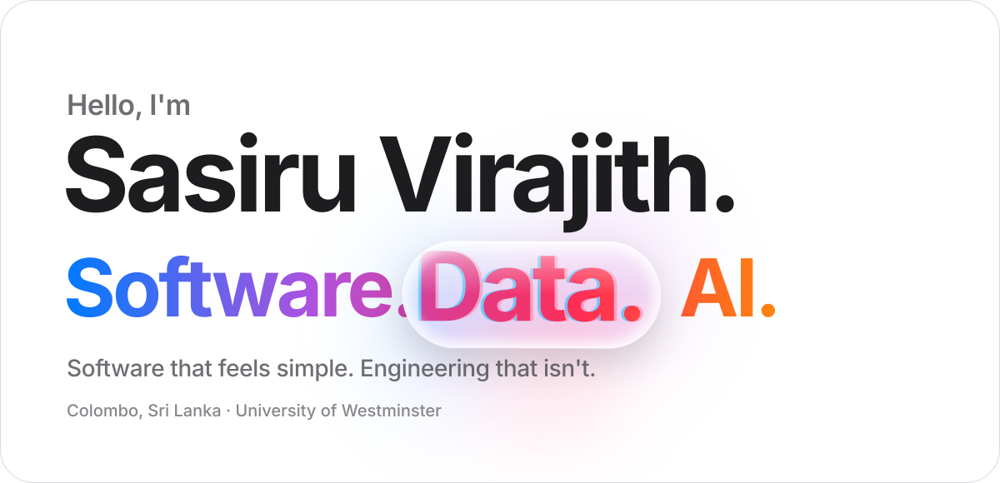
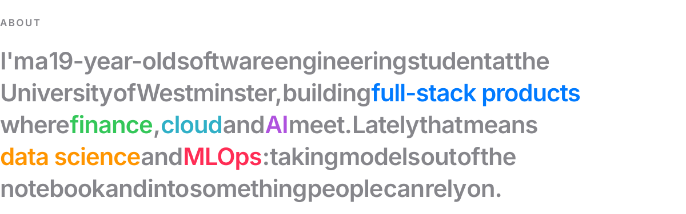
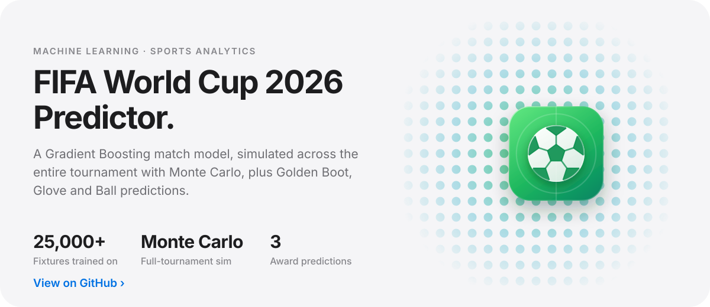
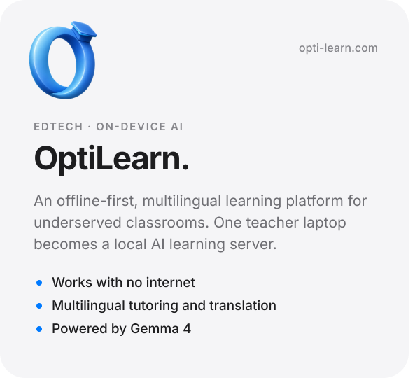
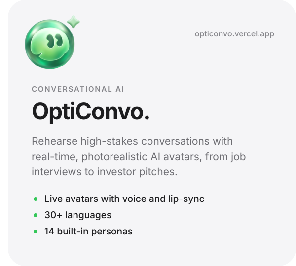
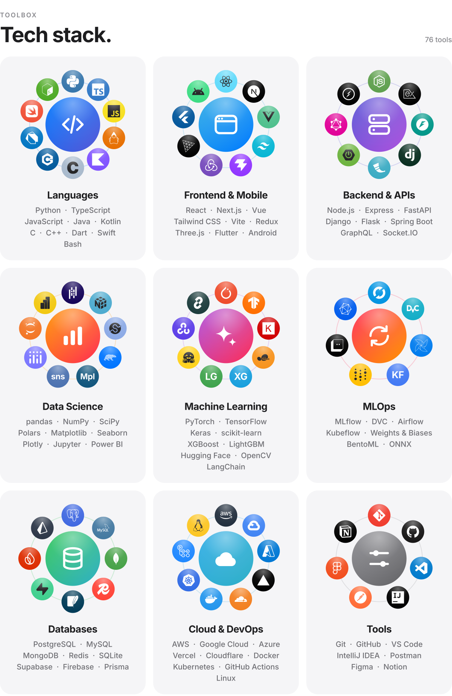
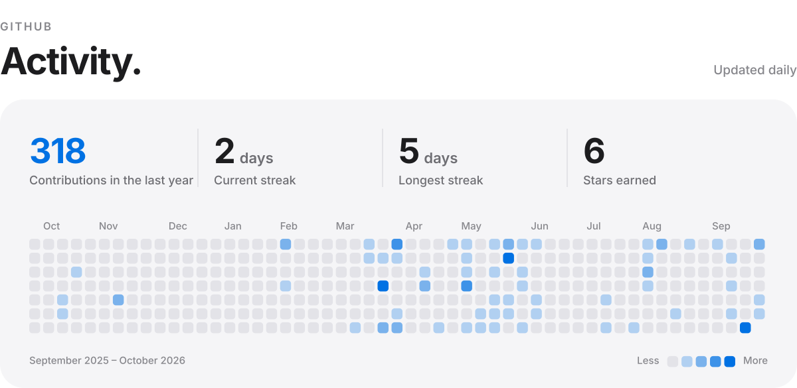
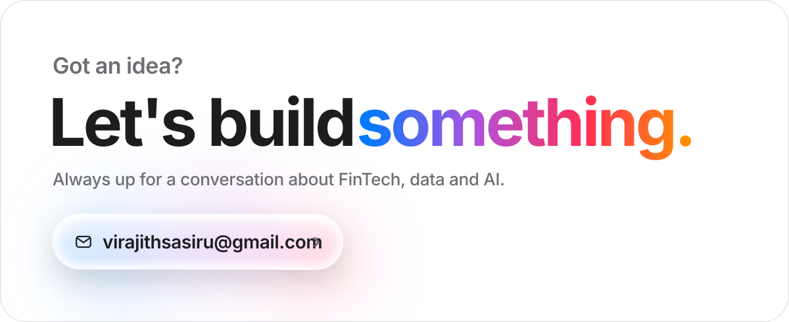

<!--
  Profile README for github.com/SasiruVirajith

  Every section is an SVG drawn from one set of design tokens (tools/design.py),
  in a light and a dark version that follows the viewer's GitHub theme.
    - Text and content:  edit tools/build_assets.py, then run  python tools/build_assets.py
    - Activity:          rebuilt daily by .github/workflows/activity.yml
-->

<a href="https://github.com/SasiruVirajith"><picture><source media="(prefers-color-scheme: dark)" srcset="assets/hero-dark.svg"></picture></a>

  <a href="mailto:virajithsasiru@gmail.com"><picture><source media="(prefers-color-scheme: dark)" srcset="assets/buttons/email-dark.svg"></picture></a>&nbsp;
  <a href="https://www.linkedin.com/in/sasiru-virajith/"><picture><source media="(prefers-color-scheme: dark)" srcset="assets/buttons/linkedin-dark.svg"></picture></a>&nbsp;
  <a href="https://x.com/saziruVR"><picture><source media="(prefers-color-scheme: dark)" srcset="assets/buttons/x-dark.svg"></picture></a>&nbsp;
  <a href="https://www.instagram.com/saziru.vr"><picture><source media="(prefers-color-scheme: dark)" srcset="assets/buttons/instagram-dark.svg"></picture></a>

 

<picture><source media="(prefers-color-scheme: dark)" srcset="assets/about-dark.svg"></picture>

  

<picture><source media="(prefers-color-scheme: dark)" srcset="assets/featured-header-dark.svg"></picture>

<a href="https://github.com/SasiruVirajith/fifa-world-cup-2026-predictor"><picture><source media="(prefers-color-scheme: dark)" srcset="assets/projects/world-cup-predictor-dark.svg"></picture></a>

<a href="https://opti-learn.com/"><picture><source media="(prefers-color-scheme: dark)" srcset="assets/projects/optilearn-dark.svg"></picture></a>
<a href="https://opticonvo.vercel.app/"><picture><source media="(prefers-color-scheme: dark)" srcset="assets/projects/opticonvo-dark.svg"></picture></a>

<a href="https://opti-learn.com/"><picture><source media="(prefers-color-scheme: dark)" srcset="assets/buttons/website-dark.svg"></picture></a>
<a href="https://github.com/SasiruVirajith/OptiLearn"><picture><source media="(prefers-color-scheme: dark)" srcset="assets/buttons/github-dark.svg"></picture></a>
<a href="https://opticonvo.vercel.app/"><picture><source media="(prefers-color-scheme: dark)" srcset="assets/buttons/website-dark.svg"></picture></a>
<a href="https://github.com/SasiruVirajith/OptiConvo"><picture><source media="(prefers-color-scheme: dark)" srcset="assets/buttons/github-dark.svg"></picture></a>

  

<picture><source media="(prefers-color-scheme: dark)" srcset="assets/specs-dark.svg"></picture>

  

<picture><source media="(prefers-color-scheme: dark)" srcset="assets/activity-dark.svg"></picture>

  

<a href="mailto:virajithsasiru@gmail.com"><picture><source media="(prefers-color-scheme: dark)" srcset="assets/footer-dark.svg"></picture></a>

  

